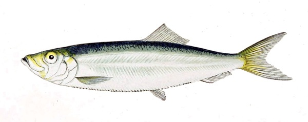

Sprats
======



Collection of my personal helper tools for developing python applications. 

To use it as a dependency add following to your `pyproject.toml` file

```toml
dependencies = [
    "sprats @ git+https://github.com/priimak/sprats.git@v0.1.1"
]
```